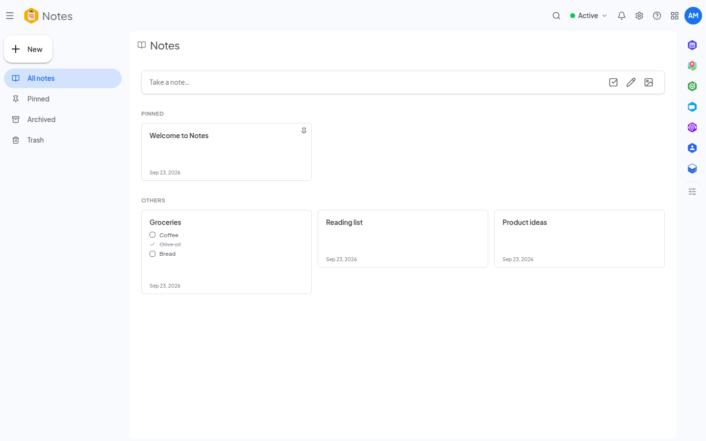

<!--
  SPDX-FileCopyrightText: 2026 Kubuno contributors
  SPDX-License-Identifier: AGPL-3.0-or-later
-->

<div align="center">


# Kubuno — Notes

[](LICENSE)


**Note-taking for [Kubuno](https://github.com/kubuno/core) — the self-hosted, libre (AGPLv3) cloud platform, a sovereign alternative to Google Workspace and Microsoft 365.**

Capture notes and checklists, organize them in nested notebooks and colored labels, connect them with bidirectional links, search everything instantly, and share what you choose — all on your own server.

</div>

---

## Screenshots



<sub>Pinned notes, checklists and colour-coded cards</sub>

## Features

- **Notes** — Markdown editing, checklists, colors, pinning, archive and trash. Note contents are stored as `.kbnot` files, so your notes live alongside your other documents in Drive.
- **Notebooks & labels** — organize notes in nested notebooks and tag them with colored labels.
- **Full-text search** — titles, bodies and voice-note transcripts are reduced to accent-folded word stems, so a plural finds its singular and a query typed without accents still finds an accented note — identically on every database engine. A "Contains the words" filter field stays in sync with the search bar both ways.
- **Bidirectional links & graph** — link notes to each other with `[[wiki-style]]` references and explore the resulting knowledge graph and backlinks (toggleable instance-wide).
- **Reminders** — attach reminders to notes; a background worker delivers them when due.
- **Sharing** — share notes with other users, or publish them behind a public link (optionally time-limited, subject to admin policy).
- **Cross-module clipboard** — pasting data copied from another Kubuno module (an event, a contact, a place…) inserts a readable, linked Markdown block instead of a plain-text dump.
- **Linkable views** — every sidebar view (pinned, archived, a notebook, a label…) has a real, shareable URL, so deep links and the browser Back button just work.
- **Delta sync** — cursor-based `/notes/delta`, `/notebooks/delta` and `/labels/delta` endpoints expose an ordered, paginated change feed (tombstones included) for local-first clients, which can mint IDs offline and replay their changes against the server.
- **Admin settings** — instance-wide defaults (auto-save interval, spell check, bidirectional links, public-sharing policy, note size and trash retention) are declared in `module.toml` and managed from the core's admin console.
- **Your choice of database** — runs on PostgreSQL, MySQL/MariaDB or SQLite, picked by the administrator in configuration and read at start-up; SQLite needs no database server at all, which makes a single-machine or evaluation install trivial.

## Architecture

Kubuno is **modular**: a **core** (the platform's "operating system") plus independent **modules**. Each module — Notes included — is a **separate process** that connects to the core at startup on its own dedicated port (**3104** for Notes); the core proxies its routes (`/api/v1/notes/*`), distributes events and serves its runtime-loaded React frontend bundle.

- **Backend** — `src/`: Axum + SQLx through the shared `kubuno-db` layer — PostgreSQL (schema `notes`), MySQL/MariaDB or SQLite; migrations in `migrations/`.
- **Frontend** — `frontend/`: a React bundle built to `entry.js`, consuming `@kubuno/sdk`, `@ui` and `@kubuno/drive` from the host at runtime via its import map.

## Install

The easiest way to self-host a full Kubuno instance (core + every module, Notes included) is the **all-in-one Docker image** (`ghcr.io/kubuno/kubuno`). See **[kubuno/docker](https://github.com/kubuno/docker)** for `docker compose` instructions.

To add this module to an existing instance, install its **Kubuno package** (`.kbpkg`) — the single format the core installs by itself, the same file on Linux, Windows and macOS. Grab it from the admin console's marketplace, or install it offline from the command line:

```bash
sudo kubuno modules:install dist/notes-<version>-<os>-<arch>.kbpkg
sudo systemctl restart kubuno         # the core loads the module on (re)start
```

The `.kbpkg` is a ZIP archive rooted at the module folder; the core unpacks it in pure Rust, so installation is identical on every platform. It is the **only** distribution format for a module — a module is not a system service, so there are no `.deb`/`.rpm`/`.exe`/`.pkg` packages.

## Build & development

**Requirements:** Rust ≥ 1.82, Node.js ≥ 24, and PostgreSQL 16, MySQL/MariaDB or SQLite (no server needed).

```bash
cargo build --release                     # → target/release/kubuno-notes (shared crates from git tags)
cd frontend && npm ci && npm run build    # → dist/{entry.js, entry.css} (@kubuno/* from npm)
bash build_kbpkg.sh                       # → dist/notes-<version>-<os>-<arch>.kbpkg
bash build_kbpkg.sh --install             # build, install into the local module store, and restart
```

> Shared dependencies come from Kubuno — no `kubuno/core` checkout required:
> - **Rust** — shared crates via tagged git dependencies on `kubuno/core`.
> - **Frontend** — `@kubuno/sdk`, `@kubuno/ui` and `@kubuno/drive` from the `@kubuno` npm scope, resolved at runtime to the host's singletons through its import map.

## Configuration

Copy `config.toml.example` → `config.toml`, or use environment variables (`KUBUNO_CORE_URL`, `KUBUNO_INTERNAL_SECRET`, `KUBUNO_DB_*`). The database engine is the administrator's choice, set in `[database] engine` — `postgres` (default), `mysql`/`mariadb` or `sqlite` — and read at start-up: the same binary connects to whichever is named, and SQLite needs no server at all. Under the Kubuno supervisor the connection settings are injected by the core. See `module.toml` for the manifest (id, port, routes, sidebar entry, settings).

## Tech stack

Rust 2021 · Axum 0.7 · Tokio · SQLx 0.9 via `kubuno-db` (PostgreSQL, MySQL/MariaDB or SQLite; schema `notes`) — React 19 · TypeScript · Vite · Tailwind CSS v4 · Zustand · React Query.

## Contributing

Contributions are welcome. Please open an issue to discuss any significant change before submitting a pull request.

## License

[AGPL-3.0-or-later](LICENSE) © Kubuno contributors.
